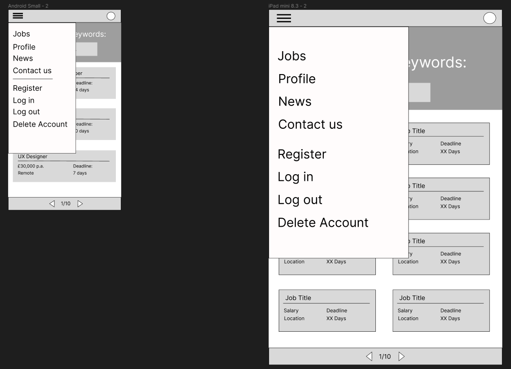
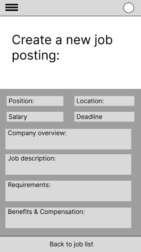

# **Devs and Roles**

Developed by Jeremy Simons

[Link to live site](https://devs-and-roles.herokuapp.com/)

## Introduction

Devs and Roles is the proposed solution to platforms such as linkedIn which generate too much noise from professionals who are not from the tech industry. It aims to provide a community for software developers and other tech professionals to, firstly, gain access to new job opportunities. Secondly, the site aims to connect with tech professionals with other tech professionals and recruiters who are actively seeking quality talent for their clients or companies.

With the blog feature, it allows professionals and recruiters alike to market themselves with long-format, high-quality content rather than the sound-bite feed of memes and platitudes on other platforms. Recruiters have the ability to search through a catalogue of job-seeking users to connect with them directly.

The ultimate goal of these features is to expedite the recruitment process for tech workers and recruiters alike.

## Contents

* [Project Goals](#project-goals) 
    * [For the user](#for-the-user)
    * [For the site owner](#for-the-site-owner)
* [User Experience](#user-experience) 
    * [Target audience](#target-audience)
    * [User requirements](#user-requirements)
    * [User Manual](#user-manual)
    * [User Stories](#user-stories)
* [Design](#design)
    * [wireframes](#wireframes)
* [Technical Design](#technical-design)
    * [Data Models](#data-models)
    * [Database Schema](#database-schema)
* [Features](#features)
    * [App Features](#app-features)
    * [Feature Ideas for future development](#feature-ideas-for-future-development)
* [Technologies Used](#technologies-used)
* [Deployment & Local Development](#deployment--local-development)
* [Testing](#testing)
    * [Validation](#validation)
    * [Manual Testing](#manual-testing)
    * [Automated Testing](#automated-testing)
    * [Bugs](#bugs)
* [Credits](#credits)

## Project Goals

### ...For the user

* To view job openings and apply for them to progress in one's own career
* To gain access to potential candidates for a tech role that I may be needing to fill.
* To interact with other members of the software development and hiring community in order to expand professional networks.

### ...For the site owner

* To provide a platform for tech recruiters and tech workers to interact and to facilitate the hiring process.
* To keep users safe from malicious or inappropriate content by having the ability to report and remove user-made content.

## User Experience

### Target audience

The target audience of this website is threefold:
    1. Non-committed users who just want to browse the job market without signing up or applying.
    2. Committed job-seekers who are actively pursuing job opportunities.
    3. Recruiters who are seeking to attract talent to their companies or clients.

### User requirements

* Users must be able to share their thoughts/work/expertise in a community which allows them to interact and network with other users.
* Users must have features tailored to what their aims are.
* As job-seekers they must be able to apply for jobs and keep track of their applications.
* As recruiters they must be able to view and message candidates via their candidate profiles. They must also be able to track who has applied to their job postings as well as view the details of each application.

### User Manual

Click the dropdown to view the user manual:

User Manual

### Home page

When accessing the site for the first time users will arrive on the home page and will be able to scroll through the job listings as well as click on each one to view the details. Apart from this the user will not be able to interact with the site and the navbar will only display the home option.

The user may access any links in the footer, however they will not be able to submit a valid contact form without first signing up.

### Login/register

When registering, users must fill out the form providing username, email and password. Username and password will be needed to subsequently log back into the account.

### Complete the user profile

Upon registering a new account, the user will be directed to the profile creation page. Not only will this provide information that other site users can view, it will determine which site features are available to users (by selecting job-seeker or recruiter options respectively).

### Access site features

* All users will have access to the blog community. Users can create, peruse, update and delete their blogs.
* All users will have access to the commenting feature on all blog posts. Note that any inappropriate posts or comments are reportable and may be removed from the site by the admin if necessary.
* All users will have access to the contact form to raise issues with the site admin.
* if you selected recruiter you will now be able to create, update, and delete job postings, view candidate profiles, and message candidates.
  * Please note that job postings are reportable and may be removed without warning if deemed inappropriate, malicious, or fake.
* if you selected job-seeker you will now be able to apply for job postings and view a list of your current applications.

### Notifications

Upon completing any of the above actions, the user should be notified with a popup message. These are set to auto close after 3 seconds.

 

### User Stories

#### As a job-seeker user...

#### As a recruiter user... 

#### As the site owner...

## Design

#### Fonts

Roboto mono was chosen as the main font for this website because of its readability and because of its similarity to fonts used in IDEs. This gives the site the feeling that it is a place that invites developers to interact with the site and contribute to the community. [Google Fonts](https://fonts.google.com/specimen/Roboto+Mono?query=roboto) were used to import Roboto mono to the site.

#### Colours

[Coolors.co](https://coolors.co/104f55-32746d-f4d8cd-01200f-011502 ) was used to generate the color palate of the site. The dark and light green combination was chosen because, coupled with roboto mono, the light-coloured text on the dark green background emulates a development terminal.

### Wireframes

    
Small - Mobile

    
Authentication

    

    
Homepage

    

    
Homepage sidenav

    

    
Blog list

    

    
Candidate list

    

    

    
Job form

    

    
Profile form

    

    
Blog form

    

    
Job details

    

    
Profile details

    

    
Blog details

    

    
Error pages

    

    
Medium - Tablet

    
Authentication

    

    
Homepage

    

    
Homepage sidenav

    

    
Blog list

    

    
Candidate list

    

    
Job form

    

    
Profile form

    

    
Blog form

    

    
Job details

    

    
Profile details

    

    
Blog details

    

    
Error pages

    

    
Large - Desktop

    
Authentication

    

    
Homepage

    

    
Blog list

    

    
Candidate list

    

    
Job form

    

    
Profile form

    

    
Blog form

    

    
Job details

    

    
Profile details

    

    
Blog details

    

    
Error pages

    

## Agile workflow

An agile methodology was employed for this project. Epics were created and each user story was assigned to an epic. Development of the project was organised into iterations where certain features were implemented to their completion before reviewing the backlog and re-assigning tasks for the next iteration.

This was achieved and tracked using the github issues/projects/kanban board features.

Any bugs found in the development process were also logged here and dealt with as backlog tasks.

### User stories

User stories and bug reports were uploaded to the project using Github issues templates. User stories were ranked with one of the following labels:

* Must have
* Should have
* Could have
* Wont have (decision made that the feature is not needed and improving other features is higher priority with remaining time)

These categories were used to prioritise the workload.

### Epics

5 epics were created using Github milestones and the user stories (uploaded as issues in the project).

The fifth epic for the news aggregation feed was categorised entirely as 'could have'. Towards the end of the development of other features, it became apparent that this needed to be moved to the 'wont have' category in order to maximise quality of the other features.

### Kanban board

GitHub Kanban boards were used to track the progress of development:

## Technical Design

### Database Schema

A relational database schema was created using [Lucidchart](https://lucid.app/) to visualise the relationships between different collections of data.

    
Diagram

    
Database for Devs & Roles:

    

 

### Data Models

* Django models were used to represent the tables specified in the technical design of the backend.
* Data points are represented as attributes of the model (inheriting from django's model class).

## Features

The website has fourteen pages and a variety of CRUD functionalites. Users are able to access a limited number of features without signing up. Different pages are accessbile to registered users depending on what their job-seeker/recruiter settings are toggled to on their profile.

### App Features:

    
Game Title

    
This is what the user sees upon loading the site. The title text appears with a simple animation for visual appeal. There is also a login/signup feature here.

    <ul>
        <li>
            
Sign up y/n options

        </li>
        <li>
            
        </li>
        <li>
            
User story covered: 1, 7

        </li>
        <li>
            
Authentication - you cannot log in with an account that doesn't exist.

        </li>
        <li>
            
        </li>
        <li>
            
User story covered: 4, 11, 12

        </li>
        <li>
            
Validation - cannot sign up with invalid user data

        </li>
        <li>
            
        </li>
        <li>
            
User story covered: 4, 11, 12

        </li>
    </ul>

 

### Feature ideas for future development

In future the website could be further developed and improved to offer more
features and feedback to users. Some ideas include:

* A functioning smtp to run password reset emails, and other notifications to users in the case of applications being made/responded to.
* A news aggregation page that uses the mediastack API to scrape tech news and display it in a paginated list of news articles on the site.
* Modifying the job application model, and wiring up another media hosting service, so that users can upload a pdf CV/resume, and recruiters can download it when reviewing applications.
  
## Technologies Used

### Languages used

* Python
* HTML
* CSS
* JavaScript

### Other tools/websites/libraries used
* [Lucidchart](https://lucid.app/) was used to create wireframes.
* [Git](https://git-scm.com/) was used for version control.
* [GitHub](https://github.com/) was used for saving and storing files.
* [Codeanywhere](https://app.codeanywhere.com/) was the IDE used for writing and editing code.
* [Heroku](https://id.heroku.com/) was used as the hosting platform for this site.
* [amiresponsive](https://ui.dev/amiresponsive?url=https://jeremyhsimons.github.io/CI_PP2_SavvySaver/) was used to test the website across different screens and generate the picture in the [Design](#design) section.

#### 3rd party Python Libraries used

## Deployment & Local Development

The website was deployed to [Heroku](https://id.heroku.com/) using the following process:
1. Login or create an account at [Heroku](https://dashboard.heroku.com/)

1. Click on New > Create new app in the top right of the screen.

1. Add an app name and select location, then click 'create app'.

1. Under the deploy tab of the next page, select connect to GitHub.
1. Log in to your GitHub account when prompted.

1. Select the repository that you want to be connected to the Heroku app.

1. Click on the settings tab.

1. Scroll down to the config vars section, and add 2 config vars:
    * The first key is CREDS and the value here is the creds.json file that was generated for the google sheets API to work properly.
    * The second key is PORT and the Value is 8000

1. Once you have set up the config vars, scroll down to buildpacks (still under the settings tab)
1. Add the Python and Node.js buildpacks to your app and make sure that when they are displayed, they appear in the order:
    * Python
    * Node.JS

1. Navigate back to the settings tab.
1. Select automatic deploys to allow Heroku to build the site with new changes each time changes are pushed to GitHub.

1. In the 'manual deploy' section beneath this, make sure the branch selected is 'main' and click deploy branch.

1. The site should now be built and Heroku should provide a url for the built site.

This repository can be forked using the following process:
1. On the repository's page, go to the top-right of the page underneath the dark ribbon.
1. Click on the fork button
1. You can now work on a fork of this project. 

This repository can be cloned using the following process:
1. Go to this repository's page on GitHub.
1. Click on the code button (not the one in the navbar, but the one right above the file list).
1. Select an option, HTTPS, SSH, GitHub CLI.
1. Copy the url below to your clipboard.
1. Open Git Bash/your IDE terminal.
1. Ensure the directory you are working in is the correct one you want to paste the project into.
1. Type the command '$ git clone'
1. Paste the URL of the repository after this.
1. Hit enter on your keyboard and the project will be cloned.
 
## Testing
### Debugging
The site was tested using the following browsers:
* Google Chrome
* Mozilla Firefox
* Microsoft Edge

The site was tested on the following devices:
* Lenovo Ideapad 520S (Windows 10)
* Huawei PSmart 2019 (EMUI version 12.0.0)

### Validation

#### PEP8 Python Validator (from Code Institute)

Code institute's own Python Linter [pep8](https://pep8ci.herokuapp.com/) was used to validate all Python code in this project.

All code passed with no errors apart from the run.py file where the line limit of 80 characters had to be exceeded to display the title. These were the only errors that were found in this file.

### Manual Testing

|User story|Feature|Test|Expected Result|Actual Result|
|---|---|---|---|---|
| 1. Sign up as a new player | Sign-up prompt | When prompted by the opening view of the game, answer 'n', enter new details and type 'enter' | Program accepts/signs user up. | Works as expected. |

    
Screenshots

     

 

### Automated Testing
Unit test suites were written for all the models.py, forms.py, and views.py of each app within this django project.

    
Screenshots

 

### Bugs

| Bug Description  | Action Taken to Fix  |
|---|---|

## Credits

### 3rd party code used

#### 3rd party Python libraries/modules

#### Code found online when solving bugs in own code.
* credits to the CI team for the code used to fetch/display git hub profile information

### Acknowledgements

* Thanks to my Mentor Mo Shami for his immensely valuable feedback, advice and encouragement throughout this project. Thanks for pushing me to do the best I can!
* Thanks to the wonderful CI London Community for all the moral support!.
* Thanks to Oli for his user acceptance tesing and feedback. Cheers for breaking my site...