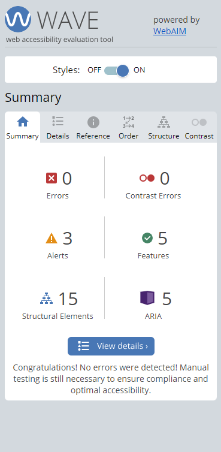

# **Devs and Roles**

Developed by Jeremy Simons

[Link to live site](https://devs-and-roles.herokuapp.com/)

## Introduction

Devs and Roles is the proposed solution to platforms such as linkedIn which generate too much noise from professionals who are not from the tech industry. It aims to provide a community for software developers and other tech professionals to, firstly, gain access to new job opportunities. Secondly, the site aims to connect with tech professionals with other tech professionals and recruiters who are actively seeking quality talent for their clients or companies.

With the blog feature, it allows professionals and recruiters alike to market themselves with long-format, high-quality content rather than the sound-bite feed of memes and platitudes on other platforms. Recruiters have the ability to search through a catalogue of job-seeking users to connect with them directly.

The ultimate goal of these features is to expedite the recruitment process for tech workers and recruiters alike.

## Contents

* [Project Goals](#project-goals) 
    * [For the user](#for-the-user)
    * [For the site owner](#for-the-site-owner)
* [User Experience](#user-experience) 
    * [Target audience](#target-audience)
    * [User requirements](#user-requirements)
    * [User Manual](#user-manual)
    * [User Stories](#user-stories)
* [Design](#design)
    * [wireframes](#wireframes)
* [Technical Design](#technical-design)
    * [Data Models](#data-models)
    * [Database Schema](#database-schema)
* [Features](#features)
    * [Feature Ideas for future development](#feature-ideas-for-future-development)
* [Technologies Used](#technologies-used)
* [Deployment & Local Development](#deployment--local-development)
    * [Database](#database)
    * [Heroku deployment](#heroku-deployment)
    * [Forking GitHub Repository](#forking-github-repository)
    * [Cloning GitHub Repository](#cloning-github-repository)
* [Testing](#testing)
* [Validation](#validation)
* [Bugs](#bugs)
* [Credits](#credits)

## Project Goals

### ...For the user

* To view job openings and apply for them to progress in one's own career
* To gain access to potential candidates for a tech role that I may be needing to fill.
* To interact with other members of the software development and hiring community in order to expand professional networks.

### ...For the site owner

* To provide a platform for tech recruiters and tech workers to interact and to facilitate the hiring process.
* To keep users safe from malicious or inappropriate content by having the ability to report and remove user-made content.

## User Experience

### Target audience

The target audience of this website is threefold:
    1. Non-committed users who just want to browse the job market without signing up or applying.
    2. Committed job-seekers who are actively pursuing job opportunities.
    3. Recruiters who are seeking to attract talent to their companies or clients.

### User requirements

* Users must be able to share their thoughts/work/expertise in a community which allows them to interact and network with other users.
* Users must have features tailored to what their aims are.
* As job-seekers they must be able to apply for jobs and keep track of their applications.
* As recruiters they must be able to view and message candidates via their candidate profiles. They must also be able to track who has applied to their job postings as well as view the details of each application.

### User Manual

Click the dropdown to view the user manual:

User Manual

### Home page

When accessing the site for the first time users will arrive on the home page and will be able to scroll through the job listings as well as click on each one to view the details. Apart from this the user will not be able to interact with the site and the navbar will only display the home option.

The user may access any links in the footer, however they will not be able to submit a valid contact form without first signing up.

### Login/register

When registering, users must fill out the form providing username, email and password. Username and password will be needed to subsequently log back into the account.

### Complete the user profile

Upon registering a new account, the user will be directed to the profile creation page. Not only will this provide information that other site users can view, it will determine which site features are available to users (by selecting job-seeker or recruiter options respectively).

### Access site features

* All users will have access to the blog community. Users can create, peruse, update and delete their blogs.
* All users will have access to the commenting feature on all blog posts. Note that any inappropriate posts or comments are reportable and may be removed from the site by the admin if necessary.
* All users will have access to the contact form to raise issues with the site admin.
* if you selected recruiter you will now be able to create, update, and delete job postings, view candidate profiles, and message candidates.
  * Please note that job postings are reportable and may be removed without warning if deemed inappropriate, malicious, or fake.
* if you selected job-seeker you will now be able to apply for job postings and view a list of your current applications.

### Notifications

Upon completing any of the above actions, the user should be notified with a popup message. These are set to auto close after 3 seconds.

 

### User Stories

#### As a job-seeker user...

(1) As a new user I want to sign up to the job board so that I can view new job openings.

(2) As a job seeker I want to view a paginated list of job opportunities so that I can find a role suitable for me.

(3) As a job seeker I want to create a profile so that employers can find out more about me.

(4) As a job seeker I want to easily navigate between job postings and my profile so that I can access the features I need.

(5) As a job seeker I want to see which jobs I have already applied for so that I can keep track of the application/follow it up.

(6) As a job seeker I want to fill out a form to apply for a job, so that I can be considered for it by the employer.

(7) As a job seeker I want to be able to see how many other applicants have already applied to each role on the job board.

(8) As a jobseeker I want to withdraw my application so that I can notify the employer I no longer wish to be considered for the role.

(9) As a job seeker/recruiter I want to be able to create a blog post so that I can show employers more of my interest/skills or attract talent.

(10) As a job seeker/recruiter I want to comment on blog posts so that I can interact with other users.

(11) As a jobseeker I want to report any suspicious or malicious posts on the job board.

(12) As the job seeker I want to contact the site owner about potential problems/bugs with the site so that they can be fixed.

#### As a recruiter user... 

(13) As a new user I want to sign up to the job board so that I can post new jobs and view profiles of existing candidates so that I can fill a role.

(14) As an employer I want to create a job posting that can be approved and added to the job board so that I can advertise a role.

(15) As an employer I want to take down a job posting when I have filled the role so that I don't get swamped with unnecessary applications for a job.

(16) As an employer I want to edit my job posting so that I can keep it up to date with the requirements of the role I want to fill.

(17) As an employer I want to scroll through a paginated list of candidates so that I can find a good fit for my open position.

(18) As an employer I want to be able to send messages to potential candidates so that I can advertise roles that might be a good fit.

(19) As an employer I want to see how many candidates have applied to each job I post so that I can gauge which of my advertised roles are the most popular.

(20) As a recruiter or job seeker I want to delete my account if I no longer wish to use the service so that I can remove my personal data from the website.

(21) As a recruiter or job seeker I want to update my account details so that I can use my most up-to-date contact details, etc.

#### As the site owner...

(22) As the site owner I want to be able to approve job ads before they are posted to the job board.

(23) As the site owner I want to be able to revoke approval for a job ad if a jobseeker user has reported it for a legitimate reason, so that malicious posts are removed promptly.

(24) As the site owner I want users to feedback about any problems on the site so that any bugs/issues can be addressed promptly.

## Design

#### Fonts

Roboto mono was chosen as the main font for this website because of its readability and because of its similarity to fonts used in IDEs. This gives the site the feeling that it is a place that invites developers to interact with the site and contribute to the community. [Google Fonts](https://fonts.google.com/specimen/Roboto+Mono?query=roboto) were used to import Roboto mono to the site.

#### Colours

[Coolors.co](https://coolors.co/104f55-32746d-f4d8cd-01200f-011502 ) was used to generate the color palate of the site. The dark and light green combination was chosen because, coupled with roboto mono, the light-coloured text on the dark green background emulates a development terminal.

### Front End Libraries
The [Materialize](https://materializecss.com/) CSS and JavaScript library was used to create the layout of the front end. The classes included in this library were used to make the site fully responsive and also to provide satisfying feedback to users regarding their actions.

* The grid system (rows and columns) was used to generate the layout of job postings, blog posts, and candidate list on the site.
* In conjunction with the [Django Crispy Forms](https://django-crispy-forms.readthedocs.io/en/latest/) library, Materialize forms were used to generate clean and attractive form fields.
* Materialize 'modals' and 'toasts' were used to defensively programme delete functionality in the site. These features provide users with adequate notification of the consequences of their actions without redirecting them unnecessarily to extra pages.

### Wireframes

    
Small - Mobile

    
Authentication

    

    
Homepage

    

    
Homepage sidenav

    

    
Blog list

    

    
Candidate list

    

    

    
Job form

    

    
Profile form

    

    
Blog form

    

    
Job details

    

    
Profile details

    

    
Blog details

    

    
Error pages

    

    
Medium - Tablet

    
Authentication

    

    
Homepage

    

    
Homepage sidenav

    

    
Blog list

    

    
Candidate list

    

    
Job form

    

    
Profile form

    

    
Blog form

    

    
Job details

    

    
Profile details

    

    
Blog details

    

    
Error pages

    

    
Large - Desktop

    
Authentication

    

    
Homepage

    

    
Blog list

    

    
Candidate list

    

    
Job form

    

    
Profile form

    

    
Blog form

    

    
Job details

    

    
Profile details

    

    
Blog details

    

    
Error pages

    

## Agile workflow

An agile methodology was employed for this project. Epics were created and each user story was assigned to an epic. Development of the project was organised into iterations where certain features were implemented to their completion before reviewing the backlog and re-assigning tasks for the next iteration.

This was achieved and tracked using the github issues/projects/kanban board features.

Any bugs found in the development process were also logged here and dealt with as backlog tasks.

### User stories

User stories and bug reports were uploaded to the project using Github issues templates. User stories were ranked with one of the following labels:

* Must have
* Should have
* Could have
* Wont have (decision made that the feature is not needed and improving other features is higher priority with remaining time)

These categories were used to prioritise the workload.

### Epics

5 epics were created using Github milestones and the user stories (uploaded as issues in the project).

The fifth epic for the news aggregation feed was categorised entirely as 'could have'. Towards the end of the development of other features, it became apparent that this needed to be moved to the 'wont have' category in order to maximise quality of the other features.

### Kanban board

GitHub Kanban boards were used to track the progress of development:

## Technical Design

### Database Schema

A relational database schema was created using [Lucidchart](https://lucid.app/) to visualise the relationships between different collections of data.

    
Diagram

    
Database for Devs & Roles:

    

 

### Data Models

* Django models were used to represent the tables specified in the technical design of the backend.
* Data points are represented as attributes of the model (inheriting from django's model class).
* For this project, all tables' primary keys are the default django ids for object instances.

#### User model

* This was made using the django allauth library. This library handles all authentication out of the box. From the user it takes a username, email and password.

#### Contact Message model
* This includes the user who sent the contact message to the site owner as a foreign key.
* The read attribute is only used by the site admin to toggle messages they have read, and filter them out from the admin panel.

| Key | Name | Type | Validation |
|---|---|---|---|
|  | full_name | char | max_length=200, blank=False |
|  | email | email | max_length=200, blank=False |
| fk | user | User | on_delete=models.CASCADE, null=True, |
|  | date_sent | DateTime | Validation |
|  | message | Textfield | blank=False |
|  | read | bool | default=False |

#### Blog model

* User (author) is a foreign key in the blog model.
* If an instance is deleted, all related comments will also be deleted.
* Approved and reported attributes appear on several models in this site. They all serve the same purpose - for the admin to filter by approved/not approved and by reported/not reported, so that they can add or remove content from the site as is necessary.

| Key | Name | Type | Validation |
|---|---|---|---|
|  | title | char | max_length=200, unique=True |
| fk | posted_by | User | on_delete=models.CASCADE |
|  | slug | char | max_length=200, unique=True |
|  | content | text |  |
|  | summary | text |  |
|  | featured_image | cloudinary | 'image', default='placeholder' |
|  | created_on | datetime | auto_now_add=True |
|  | approved | bool | default=True |
|  | reported | bool | default=False |

#### Comment model

* Related blog post is a foreign key in the comment model.  

| Key | Name | Type | Validation |
|---|---|---|---|
|  | name | char | max_length=80 |
|  | body | text |  |
| fk | blog_post | BlogPost obj | on_delete=models.CASCADE |
|  | created_on | datetime | auto_now_add=True |
|  | approved | bool | default=True |
|  | reported | bool | default=False |

#### Job posting model

* User (job post author) is a foreign key of the job post model. This takes all the data required for a user to post/view a job ad on the site.
* If an instance is deleted, all related applications will also be deleted.
* Job postings are not approved by default. They must be verified by site admin before they make it to the site/user. This is done to protect users from potentially malicious spam or fraudulent job postings.
* text fields in the job posting model must be unique. This is done defensively to stop recruiters spamming the site with duplicate job ads which may crowd out other recruiters' ads. It makes sure everyone's ads gets a fair shot at being seen.

| Key | Name | Type | Validation |
|---|---|---|---|
|  | title | char | max_length=200, unique=False |
| fk | posted_by | User | on_delete=models.CASCADE |
|  | salary | int |  |
|  | location | char | max_length=200 |
|  | closing_date | datetime |  |
|  | featured_image | cloudinary | 'image', default='placeholder' |
|  | created_on | datetime | auto_now_add=True |
|  | company_overview | text | unique=True |
|  | job_description | text | unique=True |
|  | requirements | text | unique=True |
|  | benefits | text | unique=True |
|  | applicants | int | default=0 |
|  | approved | bool | default=False |
|  | reported | bool | default=False |

#### Job application model

* User (appplicant) and the job posting are both foreign keys. This takes all the data required for a user to apply/view an application on the site.

| Key | Name | Type | Validation |
|---|---|---|---|
| fk | candidate | User | on_delete=models.CASCADE |
| fk | job_posting | JobPosting | on_delete=models.CASCADE |
|  | created_on | datetime | auto_now_add=True |
|  | full_name | char | max_length=200 |
|  | email | email | max_length=200 |
|  | phone | int |  |
|  | linkedin | char | max_length=200 |
|  | github_username | char | max_length=200 |
|  | why_company | text | max_length=2000 |
|  | why_role | text | max_length=2000 |
|  | why_you | text | max_length=2000 |

#### User profile model

* Has a one-to-one relationship with the Allauth user model
* If deleted, the user essentially deletes their account (or makes it inactive according to Django).

| Key | Name | Type | Validation |
|---|---|---|---|
| fk | user | One-to-one field | on_delete=models.CASCADE |
|  | created_on | datetime | auto_now_add=True |
|  | first_name | char | max_length=200, blank=True |
|  | last_name | char | max_length=200, blank=True |
|  | linkedin | char | max_length=200, blank=True |
|  | github_username | char | max_length=200, blank=True |
|  | job_seeker | bool | default=False |
|  | recruiter | bool | default=False |
|  | location | char | max_length=200, blank=True |
|  | years_experience | int | null=True |
|  | education | text | blank=True |
|  | work_experience | text | blank=True |
|  | interests | text | blank=True |
|  | roles_open_to | char | max_length=200, blank=True |
|  | approved | bool | default=True |
|  | reported | bool | default=False |

#### message model

* user profile model (message recipient) is a foregin key in the message mode.
* This represents the many-to-one relationship between a profile and messages sent to it.

| Key | Name | Type | Validation |
|---|---|---|---|
| fk | recipient | User | on_delete=models.CASCADE |
|  | sent_on | datetime | auto_now_add=True |
|  | first_name | char | max_length=80, blank=False |
|  | last_name | char | max_length=80, blank=False |
|  | message | text | blank=False |
|  | email | email | blank=False |

## Features

The website has 20 pages (including error pages) and a variety of CRUD functionalites. Users are able to access a limited number of features without signing up. Different pages are accessbile to registered users depending on what their job-seeker/recruiter settings are toggled to on their profile.

### Pre-authentication:

    
Home page

    
This is what the user sees upon loading the site. It contains a paginated list of job ads on the site. Any user (authenticated or not) has access to this page.

    <ul>
        <li>
            
Home page with job postings

        </li>
        <li>
            
        </li>
        <li>
            
Job details when clicking on a job posting

        </li>
        <li>
            
        </li>
        <li>
            
navigator to get the next items

        </li>
        <li>
            
        </li>
        <li>
            
User Stories covered:1, 2

        </li>
    </ul>

 

    
Job detail page

    <ul>
        <li>
            
Page with job postings. Top nav bar with optios to report, edit / delete, the job posting depending on which user is logged in.

        </li>
        <li>
            
        </li>
        <li>
            
Hero image with clickable card to access primary job details. cards displaying other job info, including the number of applicants the job already has.

        </li>
        <li>
            
        </li>
            <li>
            
        </li>
        <li>
            
User Stories covered: 1, 7, 19

        </li>
    </ul>

    
Sign up/Log in

    <ul>
        <li>
            
Sign up and log in pages for users to create and revisit their accounts on the site.

        </li>
        <li>
             
            
        </li>
        <li>
            
        </li>
        <li>
            
User Stories covered:1, 13

        </li>
    </ul>

    
Sign out

    <ul>
        <li>
            
Separate page for authorised users to confirm sign out

        </li>
        <li>
            
        </li>
        <li>
            
        </li>
        <li>
            
User Stories covered: 1, 13

        </li>
    </ul>  

### Job Seeker Authentication

    
Create Profile

    <ul>
        <li>
            
Form that successful new sign ups are automatically redirected to after the registration form

        </li>
        <li>
            
        </li>
        <li>
            
Options for the type of account the user wishes to have. This will change which features of the site they have access to. Note, users can sign up as both job-seeker and recruiter if they wish.

        </li>
        <li>
            
        </li>
        <li>
            
User Stories covered: 3

        </li>
    </ul>

    
View Own Profile

    <ul>
        <li>
            
Users can access their profiles from the nav bar once signed up. This takes them to their profile page (if it is a job seeker profile, this will be the same page of information that recruiters can view).

        </li>
        <li>
            
        </li>
        <li>
            
        </li>
        <li>
            
Options for the user to edit/delete their profile/account, or view their messages from recruiters.

        </li>
        <li>
            
        </li>
        <li>
            
User Stories covered: 3, 4

        </li>
    </ul>

    
Edit profile details

    <ul>
        <li>
            
Form for users to edit their profile details.

        </li>
        <li>
            
        </li>
        <li>
            
User Stories covered: 3, 21

        </li>
    </ul>

    
Delete Profile

        <ul>
            <li>
                
Page warning users of the permanent deletion of their account if they delete their profile.

            </li>
            <li>
                
            </li>
            <li>
                
User Stories covered: 20

            </li>
        </ul>

    
Job application page

        <ul>
            <li>
                
Page with a form to complete in order to apply for a job.

            </li>
            <li>
                
            </li>
            <li>
                
User Stories covered: 6

            </li>
        </ul>

    
View applications

        <ul>
            <li>
                
Page with a list of applications already made. Options are included to withdraw applications or view the job description again.

            </li>
            <li>
                
            </li>
            <li>
                
User Stories covered: 5

            </li>
        </ul>

    
Withdraw applications

        <ul>
            <li>
                
What the job-seeker user views upon selecting the withdraw application button.

            </li>
            <li>
                
            </li>
            <li>
                
User Stories covered: 8

            </li>
        </ul>

### Recruiter Authentication

    
Create job posting page

        <ul>
            <li>
                
The dropdown menu recruiters get to create job ads and view job-seekers

            </li>
            <li>
                
            </li>
            <li>
                
The form that users complete to submit a job ad to the site admin for approval.

            </li>
            <li>
                
            </li>
            <li>
                
User Stories covered: 14

            </li>
        </ul>

    
Update job posting page

        <ul>
            <li>
                
button for recruiter to edit job ad.

            </li>
            <li>
                
            </li>
            <li>
                
The form that users complete to submit updates a job ad.

            </li>
            <li>
                
            </li>
            <li>
                
User Stories covered: 16

            </li>
        </ul>

    
Delete job posting

        <ul>
            <li>
                
button for recruiter to delete a job ad.

            </li>
            <li>
                
            </li>
            <li>
                
The popup that appears when users opt to delete a job ad.

            </li>
            <li>
                
            </li>
            <li>
                
User Stories covered: 15

            </li>
        </ul>

    
View Candidates

        <ul>
            <li>
                
The dropdown menu recruiters get to create job ads and view job-seekers

            </li>
            <li>
                
            </li>
            <li>
                
The paginated list of candidates recruiters can contact

            </li>
            <li>
                
            </li>
            <li>
                
User Stories covered: 17

            </li>
        </ul>

    
Message Candidates

        <ul>
            <li>
                
The profile page accessible to the recruiter via the list of candidates.

            </li>
            <li>
                
            </li>
            <li>
                
The messaging form that allows recruiters to send messages to job-seekers inviting them to chat more.

            </li>
            <li>
                
            </li>
            <li>
                
User Stories covered: 18

            </li>
        </ul>

### Admin Authentication

    
Approve jobs/revoke approval

        <ul>
            <li>
                
The admin dashboard that allows the site controller to manage the site. This feature enables admin to approve or disapprove multiple job postings in one go.

            </li>
            <li>
                
            </li>
            <li>
                
User Stories covered: 22, 23

            </li>
        </ul>

    
View contact messages from users.

        <ul>
            <li>
                
The admin dashboard page that lists the contact messages from users filling out the site contact form.

            </li>
            <li>
                
            </li>
            <li>
                
User Stories covered: 24

            </li>
        </ul>

### Features available to all authenticated users

    
Create blog post

    <ul>
        <li>
            
The navbar option to access the blog list

        </li>
        <li>
            
        </li>
        <li>
            
The button to create a new blog post

        </li>
        <li>
            
        </li>
        <li>
            
The form that allows users to submit a blog post to the site.

        </li>
        <li>
            
        </li>
        <li>
            
User Stories covered: 9

        </li>
    </ul>

    
View blog post

    <ul>
        <li>
            
The navbar option to access the blog list

        </li>
        <li>
            
        </li>
        <li>
            
Selecting one of the blog posts by clicking the 'read' button

        </li>
        <li>
            
        </li>
        <li>
            
The blog detail page which features all the blog information plus page navigation menu and comment section

        </li>
        <li>
            
        </li>
        <li>
            
User Stories covered: 9, 10

        </li>
    </ul>

    
Update blog post

    <ul>
        <li>
            
The button that users can click to edit their own blog posts.

        </li>
        <li>
            
        </li>
        <li>
            
The form that users must fill out to submit edits to their posts. There is a popup warning them not to resubmit the same data.

        </li>
        <li>
            
        </li>
        <li>
            
User Stories covered: 9

        </li>
    </ul>

    
Delete blog post

    <ul>
        <li>
            
The button that users can click to delete their own blog posts.

        </li>
        <li>
            
        </li>
        <li>
            
The modal that appears when users try to delete their blog to warn them this is a permanent action.

        </li>
        <li>
            
        </li>
        <li>
            
User Stories covered: 9

        </li>
    </ul>

    
Comment on blog post

    <ul>
        <li>
            
The Comment section of the blog detail page and the form that allows users to add their own comments to the post.

        </li>
        <li>
            
        </li>
        <li>
            
User Stories covered: 10

        </li>
    </ul>

    
Delete comment

    <ul>
        <li>
            
The button that the user can select to delete their own comment

        </li>
        <li>
            
        </li>
        <li>
            
The popup that appears when users opt to delete comments, warning them that this is a permanent action.

        </li>
        <li>
            
        </li>
        <li>
            
User Stories covered: 10

        </li>
    </ul>

    
Submit a contact form to site admin

        <ul>
            <li>
                
The contact page that allows authorized users to contact the site admin directly.

            </li>
            <li>
                
            </li>
            <li>
                
User Stories covered: 12

            </li>
        </ul>

### Feature ideas for future development

In future the website could be further developed and improved to offer more
features and feedback to users. Some ideas include:

* A functioning smtp to run password reset emails, and other notifications to users in the case of applications being made/responded to.
* A news aggregation page that uses the mediastack API to scrape tech news and display it in a paginated list of news articles on the site.
* Modifying the job application model, and wiring up another media hosting service, so that users can upload a pdf CV/resume, and recruiters can download it when reviewing applications.
* Exploring LinkedIn API to auto display candidate profiles from their provided linkedin urls
* Exploring DWP APIs to direct job-seeking users to apply for UK universal credit if they are eligible.
  
## Technologies Used

### Languages used

* Python
* HTML
* CSS
* JavaScript

### Frameworks/3rd party Libraries used for Python, CSS, JS

* [Django]() for building the MVT architecture of the site.
* [Django Summernote]() for implementing a text editor in the admin panel
* [Cloudinary]() for hosting static files.
* [Django Crispy Forms]() for rendering/formatting forms in django templates
* [Django Allauth]() for handling all user authentication features in the site.
* [Coverage] for displaying the extent of python unit testing un django apps.
* [Materialize CSS]() for frontend design/layout/responsiveness.

### Other tools/websites/libraries used
* [Figma] for creating site witeframes.
* [Favicon.io] for designing and creating site favicon.
* [Coolors.co] for selecting the site colour palate.
* [Lucidchart](https://lucid.app/) was used to create wireframes.
* [Git](https://git-scm.com/) was used for version control.
* [GitHub](https://github.com/) was used for saving and storing files.
* [Codeanywhere](https://app.codeanywhere.com/) was the IDE used for writing and editing code.
* [Heroku](https://id.heroku.com/) was used as the hosting platform for this site.
* [amiresponsive](https://ui.dev/amiresponsive?url=https://jeremyhsimons.github.io/CI_PP2_SavvySaver/) was used to test the website across different screens and generate the picture in the [Design](#design) section.

#### 3rd party Python Libraries used

## Deployment & Local Development

For ease of development, the production database was set up at the beginning of the project to ensure that everything worked correctly. This was especially important for ensuring the accessibility of static files.

### Database

1. To create a managed PostgreSQL database. Create an account or sign up to [ElephantSQL](#https://www.elephantsql.com/).

1. Once logged in, click the 'Create New Instance' button.

1. Give your database an appropriate name and select the 'Tiny Turtle' payment plan. This is the option to select if you wish to have a free, hosted database. Larger projects with greater storage needs may require a paid plan.

1. Select your preferred region (i.e. geographically, which data center your database will be hosted at.) and confirm to create your database.

1. After creating your database, navigate to the 'instances' page and select the database you just created. Copy the PostgreSQL URL from the details section. This is required for linking the django project and the deployed heroku version to the production database.

### Heroku Deployment

Before deploying to Heroku, environment variables must be defined in the django project so that local development functions correctly. Once these environment variables are set up in the workspace, the project can be deployed and the environment variables can be copied into heroku as config vars (to ensure the deployed app works correctly with 3rd party dependecies.)

1. Create a file called env.py in the root directory of your workspace and ensure that the file is included in .gitignore. These variables should NOT be committed and pushed to GitHub.
2. import os to the file.
3. os.environ['DATABASE_URL'] = URL copied from ElephantSQL
4. os.environ['SECRET_KEY'] = A randomly generated key of your choosing. This keeps django from serving data to/from an unauthorised source.
5. os.environ['CLOUDINARY_URL'] = The URL from a cloudinary account. This can be found on the following page on the [cloudinary website](#https://cloudinary.com/)

These environment variables can now be accessed and configured in the settings.py file of the django project.

The website was deployed to [Heroku](https://id.heroku.com/) using the following process:

1. Login or create an account at [Heroku](https://dashboard.heroku.com/)

1. Click on New > Create new app in the top right of the screen.

1. Add an app name and select location, then click 'create app'.

1. Under the deploy tab of the next page, select connect to GitHub.
2. Log in to your GitHub account when prompted.

1. Select the repository that you want to be connected to the Heroku app.

1. Click on the settings tab.

1. Scroll down to the config vars section, and add config vars specified at the start of this section of the README. They should look something like this:
KEY: DATABASE_URL
VALUE: postgresurlexample123.com

1. Navigate back to the settings tab.
2. Select automatic deploys to allow Heroku to build the site with new changes each time changes are pushed to GitHub.

1. In the 'manual deploy' section beneath this, make sure the branch selected is 'main' and click deploy branch.

1. The site should now be built and Heroku should provide a url for the built site.

### Forking GitHub Repository

This repository can be forked using the following process:

1. On the repository's page, go to the top-right of the page underneath the dark ribbon.
1. Click on the fork button
1. You can now work on a fork of this project.

### Cloning GitHub Repository

This repository can be cloned using the following process:

1. Go to this repository's page on GitHub.
1. Click on the code button (not the one in the navbar, but the one right above the file list).
1. Select an option, HTTPS, SSH, GitHub CLI.
2. Copy the url below to your clipboard.
3. Open Git Bash/your IDE terminal.
4. Ensure the directory you are working in is the correct one you want to paste the project into.
5. Type the command '$ git clone'
6. Paste the URL of the repository after this.
7. Hit enter on your keyboard and the project will be cloned.

## Testing

A detailed description of all automated and manual tests carried out can be found in a separate testing.md file [here](https://github.com/jeremyhsimons/CI_PP4_Devs_And_Roles/blob/main/TESTING.md)

## Validation

### HTML

All HTML pages that the W3C validator could get access to were validated with no warnings or errors in the HTML.

#### 404

Screenshots

#### Application form

Screenshots

#### Blog list

Screenshots

#### Blog post detail

Screenshots

#### Contact form

Screenshots

#### Create blog

Screenshots

#### Create job posting

Screenshots

#### Create Profile

The one error on this page is caused by materialize crispy forms's rendering of the 'create profile' form.

Screenshots

#### Delete profile

Screenshots

#### Edit blog

Screenshots

#### Home page

Screenshots

#### Job post detail

Screenshots

#### Update job posting

Screenshots

#### Login

Screenshots

#### Logout

Screenshots

#### Sign up

Screenshots

### CSS

All custom CSS was validated using the w3c css validator. The code passed with no errors or warnings.

Note: This result was for only the custom css written by the project author. The MaterializeCSS styles are not covered by this validation report.

Screenshot

### Accessibility (WAVE)

The WebAIM WAVE browser plugin was used to asses the site's accessibility. All pages passed with no errors or warnings.

#### Application Detail

Screenshot

#### Blog detail

Screenshot

#### Blog list

Screenshot

#### Candidate list

Screenshot

#### Contact

Screenshot

#### Create application

Screenshot

#### Create blog

Screenshot

#### Create job posting

Screenshot

#### Create profile

Screenshot

#### Delete profile

Screenshot

#### Edit blog

Screenshot

#### Home

Screenshot

#### Login

Screenshot

#### Job Detail

Screenshot

#### Track applications

Screenshot

#### Profile detail

Screenshot

#### Register

Screenshot

#### Sign-out

Screenshot

#### View profile

Screenshot

### Performance (Lighthouse)

### JavaScript

### PEP8 Python Validator (from Code Institute)

Code institute's own Python Linter [pep8](https://pep8ci.herokuapp.com/) was used to validate all Python code in this project.

All code passed with no errors.

## Bugs

The following bugs were documented during the development of this project:

* User object does not have userprofile attribute

screenshot:

* Materialize Checkboxes not displaying properly

screenshot:

* Submitting form to create a user profile resulted in a database error.

screenshot:

* Textarea fields in all forms are too short (vertically)

screenshot:

* Materialize Crispy Form rendering of image fields caused visual bugs with labels

screenshot:

The following issues remain unfixed, and as a consequence the features were removed so as to maintain a strong user experience without error messages to interrupt it.

* Sending reset password request results in 504 error

screenshot:

* Cannot access uploaded pdf cv file from job application.

screenshot:

## Credits

### 3rd party code used
* The code for the GitHub 

#### 3rd party Python libraries/modules

#### Code found online when solving bugs in own code.
* credits to the CI team for the code used to fetch/display git hub profile information

### Acknowledgements

* Thanks to my Mentor Mo Shami for his immensely valuable feedback, advice and encouragement throughout this project. Thanks for pushing me to do the best I can!
* Thanks to the CI tutors for all their help with bugs that I couldn't get my head round! Thanks also for helping me out when Codeanywhere did weird things and required extra adjustment!
* Thanks for the CI slack community for all your valuable input and help bugfixing!
* Thanks to the wonderful CI London Community for all the moral support!.
* Thanks to Oli for his user acceptance tesing and feedback. Cheers for breaking my site...
