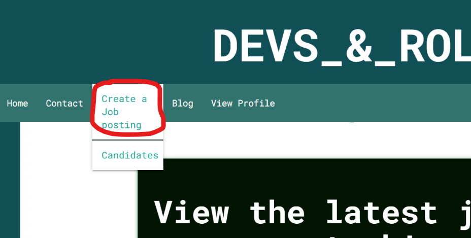
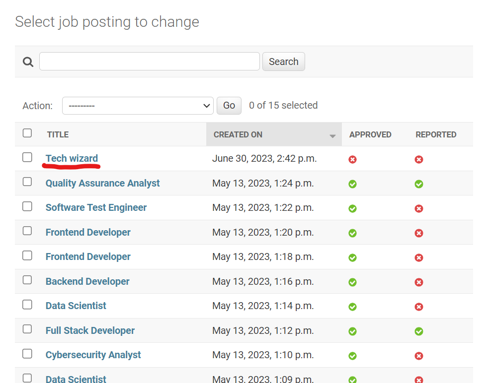
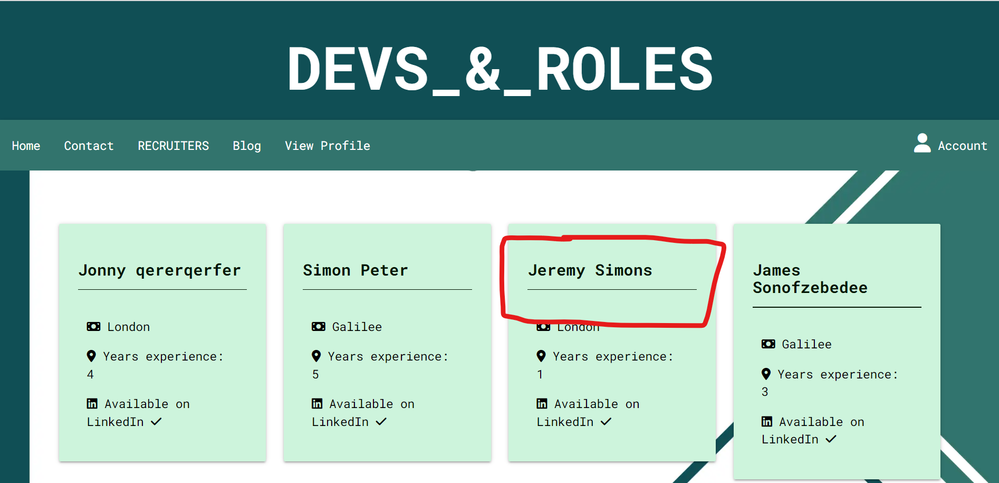
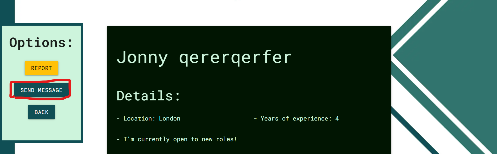

## Browser/Device Compatibility
The site was tested using the following browsers:
* Google Chrome
* Mozilla Firefox
* Microsoft Edge

The site was tested on the following devices:
* Lenovo Ideapad 520S (Windows 10)
* Huawei PSmart 2019 (EMUI version 12.0.0)

## Manual Testing

|User story|Feature|Test|Expected Result|Actual Result|
|---|---|---|---|---|
| 1. Sign up as a new user | Sign-up page | Clicking on register, entering details into the form, clicking submit | User is directed to create their profile. | Works as expected. |

    
Screenshots

     
     

 

|User story|Feature|Test|Expected Result|Actual Result|
|---|---|---|---|---|
| 2. View paginated list of jobs | Home page | entering the url of the site into browser, hitting enter. | To be taken straight away to a list of jobs which I can click on and see the details. | Works as expected. |

    
Screenshots

     

 

|User story|Feature|Test|Expected Result|Actual Result|
|---|---|---|---|---|
| 3. Create a profile for employers to find out more about me. | Create profile page | After signing up as a new user, get redirected to create profile page. Fill out the form with valid data and click submit. | When 'view profile' is now clicked in the navbar, user should see their profile details displayed correctly. | Works as expected. |

    
Screenshots

     
     
     
     
     
     

 

|User story|Feature|Test|Expected Result|Actual Result|
|---|---|---|---|---|
| 4. Easily navigate between site features. | Navbar | From the 'view profile' page, click on the home button to return to perusing the job ads. | To be redirected back to the home page with the job ads. | Works as expected. |

    
Screenshots

     
     

 

|User story|Feature|Test|Expected Result|Actual Result|
|---|---|---|---|---|
| 5. See jobs already applied for. | Track applications page | (as an authorised job-seeker) From the home page, click on the 'track application' button to see jobs applied for. | To see a list of jobs I've made applications to. clicking on one will take the user to the details of the application. | Works as expected. |

    
Screenshots

     
     
     

 

|User story|Feature|Test|Expected Result|Actual Result|
|---|---|---|---|---|
| 6. Apply for a job. | Create Application page | (as an authorised job-seeker) From the home page, click on a job to access the details. scroll down to the apply button and click it. Fill out the form that follows with valid data and click submit. | To see that an application for this job has appeared in my 'track applications page'. | Works as expected. |

    
Screenshots

     
     
     
     
     
     

 

|User story|Feature|Test|Expected Result|Actual Result|
|---|---|---|---|---|
| 7. See how many applicants there are for a job. | Job detail page. | From the home page, click on a job to access the details. scroll down to the bottom of the page. | To see the number of applicants that there are for this job. | Works as expected. |

    
Screenshots

     
     
     

 

|User story|Feature|Test|Expected Result|Actual Result|
|---|---|---|---|---|
| 8. Withdraw application. | Job detail page. | (as an authorised job-seeker) From the home page, click on the 'track applications' page and click the 'withdraw application button. Click 'delete' at the following modal. | Clicking again to the track applications page should reveal that the application is no longer listed. | Works as expected. |

    
Screenshots

     
     
     
     
     

 

|User story|Feature|Test|Expected Result|Actual Result|
|---|---|---|---|---|
| 9. Create blog post. | Create blog page. | (as an authorised job-seeker) From the home page, click on the 'blog' option and click the 'create blog post' button and fill out the following form, submitting it. | From the previous blog list page, the article should appear in the list and the data should be displayed correctly. | Works as expected. |

    
Screenshots

     
     
     
     
     

 

|User story|Feature|Test|Expected Result|Actual Result|
|---|---|---|---|---|
| 10. Comment on a blog post. | blog detail page. | (as an authorised job-seeker) From the blog list page, click on a blog post and click the comments button on the side navigation panel. At the comment section, type a comment and hit the submit button. | The page should reload, and afterwards, the comment should appear in the list of comments below the form. | Works as expected. |

    
Screenshots

     
     
     
     

 

|User story|Feature|Test|Expected Result|Actual Result|
|---|---|---|---|---|
| 11. Report Job Postings. | Job detail page. | (as an authorised job-seeker) From the home page, click on a job posting and click the amber 'report' button at the top of the page. | The user should be redirected to the home page. When accessing the job again, the report button should disappear and be replaced with text informing users that the page has been reported. | Works as expected. |

    
Screenshots

     
     
     
     

 

|User story|Feature|Test|Expected Result|Actual Result|
|---|---|---|---|---|
| 12. Contact site admin. | Contact page. | (as an authorised job-seeker) From the home page, click on the 'contact' option on the navbar. Fill out the form and click submit on the contact page. | The user should be redirected to the home page and notified of the success of their action. The contact message should appear in the admin panel. | Works as expected. |

    
Screenshots

     
     
     
     

 

|User story|Feature|Test|Expected Result|Actual Result|
|---|---|---|---|---|
| 13. Recruiter sign up. | register page/create profile. | From the home page, click on the 'register' option in the top right dropdown of the navbar. Register as a new user. Once redirected, fill out the form for the profile and select the recruiter checkbox. | The user should be redirected to the home page. The recruiters option should now appear in the navbar. | Works as expected. |

    
Screenshots

     
     
     

 

|User story|Feature|Test|Expected Result|Actual Result|
|---|---|---|---|---|
| 14. Create a job posting. | Create job posting form. | From the home page, select the recruiters option from the navbar and click on 'create a new job posting'. Complete the form with valid data and click submit. | The user should be redirected to the home page. The job posting should appear in the admin panel (awaiting approval before it appears on the site). | Works as expected. |

    
Screenshots

     
     
     
     

 

|User story|Feature|Test|Expected Result|Actual Result|
|---|---|---|---|---|
| 15. Delete job posting. | Job detail page. | From the home page, select the job posting that the user created. At the top of the detail page for this job, select the delete button. Click 'delete' on the following modal. | The job posting should disappear from the list of job postings in the admin panel. | Works as expected. |

    
Screenshots

     
     
     
     

 

|User story|Feature|Test|Expected Result|Actual Result|
|---|---|---|---|---|
| 16. Edit job posting. | Edit job page. | From the home page, select the job posting that the user created. At the top of the detail page for this job, select the edit button. Fill out the following from with valid data and click submit. | The job posting changes should appear in the job detail page. | Works as expected. |

    
Screenshots

     
     
     
     

 

|User story|Feature|Test|Expected Result|Actual Result|
|---|---|---|---|---|
| 17. View list of candidates. | Candidates page. | From the home page, select the recruiters option from the navbar and click on 'candidates' option. | The user should be directed to the candidates page and view a list of names and data. Clicking on one of the cards should direct the user to the relevant profile page. | Works as expected. |

    
Screenshots

     
     
     

 

|User story|Feature|Test|Expected Result|Actual Result|
|---|---|---|---|---|
| 18. Message candidates. | Profile details page. | From the candidates page, click on a profile and scroll down to the messages section of the page. Fill out the form and click submit. | Logging in as the recipient user should reveal the message sent when the 'view profile' tab is clicked. | Works as expected. |

    
Screenshots

     
     
     
     
     

 

|User story|Feature|Test|Expected Result|Actual Result|
|---|---|---|---|---|
| 19. View number of applicants. | Job detail page. | Covered in test for user story 7. | Covered in test for user story 7. | Covered in test for user story 7. |

|User story|Feature|Test|Expected Result|Actual Result|
|---|---|---|---|---|
| 20. Delete Account. | Delete profile page. | (As an authorised user) Click on the view profile option on the navbar. click on the delete profile button from the options side menu. On the following page, click delete. | The user should be logged out and redirected to the home page. Their user profile should be deleted from the admin panel list. | Works as expected. |

    
Screenshots

     
     
     
     

 

|User story|Feature|Test|Expected Result|Actual Result|
|---|---|---|---|---|
| 21. Update account details. | Edit profile page. | (As an authorised user) Click on the view profile option on the navbar. click on the edit profile button from the options side menu. On the following page, fill out the form with valid data. | The user should be redirected home. When 'view profile' is clicked again, the user should see updated profile information. | Works as expected. |

    
Screenshots

     
     
     

 

|User story|Feature|Test|Expected Result|Actual Result|
|---|---|---|---|---|
| 22/23. Approve/revoke approval for job postings. | Admin panel. | Log in to the admin panel. Access the job postings from the side menu. Select the desired jobs and from the top dropdown menu select approve or disapprove. Click the 'go' button. | The approval status for the selected jobs should be changed. | Works as expected. |

    
Screenshots

     
     

 

|User story|Feature|Test|Expected Result|Actual Result|
|---|---|---|---|---|
| 24. View messages from site users. | Admin panel. | Log in to the admin panel. Access the contact messages from the side menu. Select the desired message and read the text. Optionally, change the 'read' option to mark the message as read.  | The admin user should be able to read the message successfully. | Works as expected. |

    
Screenshots

     
     
     
     

 

## Automated Testing

### Automated Testing

Unit test suites were written for all the models.py, forms.py, and views.py of each app within this django project. the coverage library was used to measure the percentage of python code tested for each app. the results for each test suite, and each app's coverage are below.

    
Screenshots

 